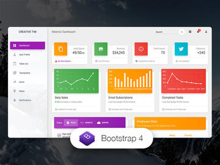
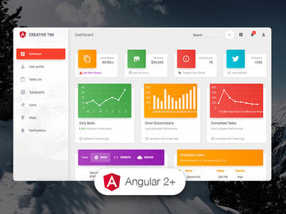

We are very excited to share this dashboard with you and we look forward to hearing your feedback!

## Versions

| HTML | React | Vue | Angular |
| --- | --- | --- | --- |
|  |  |  | 

## Quick start

- `npm i mathbloom`
- Clone the repo: `git clone https://github.com/snoronha/mathbloom.git`.

## Browser Support

At present, we officially aim to support the last two versions of the following browsers:

    

## Resources
- Demo: https://demos.creative-tim.com/material-dashboard-react
- Download Page: https://www.creative-tim.com/product/material-dashboard-react
- Documentation: https://demos.creative-tim.com/material-dashboard-react/#/documentation/tutorial
- License Agreement: https://www.creative-tim.com/license
- Support: https://www.creative-tim.com/contact-us
- Issues: [Github Issues Page](https://github.com/creativetimofficial/material-dashboard-react/issues)
- [Material Kit React - For Front End Development](https://www.creative-tim.com/product/material-kit-react?ref=github-mdr-free)

## Reporting Issues
We use GitHub Issues as the official bug tracker for the Material Dashboard React. Here are some advices for our users that want to report an issue:

1. Make sure that you are using the latest version of the Material Dashboard React. Check the CHANGELOG from your dashboard on our [website](https://www.creative-tim.com/).
2. Providing us reproducible steps for the issue will shorten the time it takes for it to be fixed.
3. Some issues may be browser specific, so specifying in what browser you encountered the issue might help.

## Technical Support or Questions

If you have questions or need help integrating the product please [contact us](https://www.creative-tim.com/contact-us) instead of opening an issue.

## Licensing

- Copyright 2020 MathBloom (https://www.mathbloom.org)
- Licensed under MIT (https://github.com/creativetimofficial/material-dashboard-react/blob/master/LICENSE.md)
